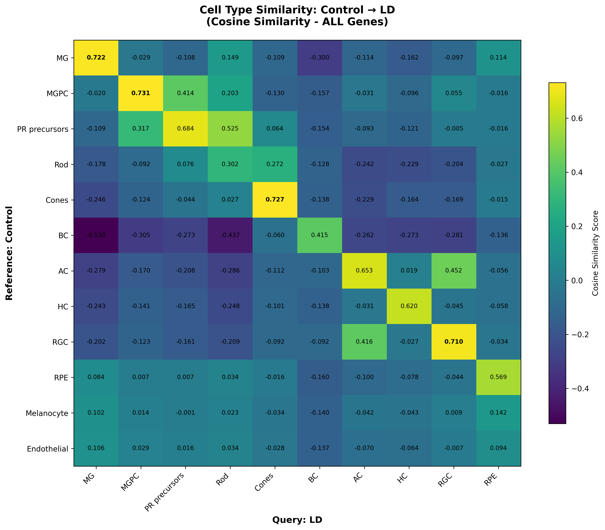

# Measuring similarities between cell types: other methods than correlations 

**Pearson correlation** measures global linear similarity across all genes and assumes comparable variance structure and direct gene-wise correspondence. In scRNA-seq data, biologically related cell types can violate these assumptions due to sparsity, nonlinear expression changes, or differences driven by a limited number of genes.

# OT using SCOT 

To relax these assumptions, we applied **Optimal Transport (OT)**–based alignment (SCOT). OT is more permissive than correlation, as it allows redistribution of expression mass and does not require one-to-one gene or cell matching. Conceptually, OT tests whether one population can be smoothly transformed into another in expression space.

SCOT applies Optimal Transport to align and compare single-cell datasets by preserving the local structure of cell populations. It uses OT to find the best way to match cells across conditions or samples based on their neighborhood relationships, enabling meaningful comparison of cell types without relying on shared labels or markers.

## What is Optimal Transport (OT)

Optimal Transport compares cell types by treating each as a cloud of cells and measuring how much “effort” it takes to move one cloud to match the other. Small effort means similar cell types; large effort means different.

# SCOT (Single-Cell Optimal Transport) Explained

## Core Concept
Finds the **minimum "work" needed to transform** one dataset into another using Optimal Transport theory.

## Earth Mover's Analogy
Two piles of sand (datasets). SCOT calculates the **minimum effort to reshape Pile A into Pile B**.

## How It Works
1. **Aligns datasets** into a shared space
2. **Computes optimal transport plan** between cells
3. **Calculates distances** in aligned space
4. **Converts to similarity**: `1 / (1 + distance)`

## Biological Interpretation
Answers: **"How easily can Control cells transform into LD cells?"**
- High similarity = Easy transformation (resilient cell types)
- Low similarity = Difficult transformation (vulnerable cell types)

## Unique Advantages
- Captures **cellular trajectories** and transition paths
- Naturally handles **batch effects**
- Preserves **local neighborhood structure**
- Provides **cell-to-cell correspondence maps**

## Output Meaning
- **> 0.7**: Easily transformable states
- **0.4-0.7**: Moderate transformation needed
- **< 0.3**: Major cellular overhaul required

## Using Zebrafish as example 

## SCOT Version

The similarity analysis was performed using **SCOT version 2** (SCOTv2), a Python tool for unsupervised alignment of single-cell multi-omics datasets.

### Citation

Demetci, P., Santorella, R., Sandstede, B., & Singh, R. (2021). Unsupervised integration of single-cell multi-omics datasets with disparities in cell-type representation. BioRxiv, 2021-11.

# Mutual Information (MI) for Measuring Similarity

Mutual Information (MI) is an information-theoretic measure that quantifies the amount of shared information between two variables. Unlike correlation measures, which often assume linear relationships, MI captures **both linear and nonlinear dependencies** between datasets.

# Understanding the Mutual Information Cell Type Comparison Script

## Conceptual Overview
This script performs a statistical comparison of gene expression patterns between two biological samples using Mutual Information (MI) as the similarity metric.

## The Core Question
"How much does knowing the gene expression distribution in a Control cell type tell us about the gene expression distribution in a Disease cell type?"

## Analogy: Orchestra Comparison
Two orchestras (Control vs Disease) with instrument sections (cell types) playing notes (genes). MI asks: "If I hear a pattern in Orchestra A's violins, can I predict Orchestra B's violin pattern?"

## Key Insights
1. **Captures Non-Linear Relationships**: Detects any statistical dependency, not just linear correlations
2. **Distribution-Based**: Compares entire expression distributions gene-by-gene
3. **Biological Interpretation**:
   - High MI (>0.7): Resilient cell types maintaining identity
   - Low MI (<0.3): Vulnerable cell types with disrupted regulation

## Practical Applications
For zebrafish Control vs LD study:
- Identify resilient/vulnerable cell types
- Detect cell state transitions
- Understand regulatory program disruptions

## Why MI Beats Simple Metrics
- Correlation: Only linear relationships
- Cosine: Only angle between mean vectors  
- MI: Any statistical dependency (linear AND non-linear)

## Bottom Line
Provides deep, distribution-aware comparison of cellular states across conditions, revealing not just similarity but how gene regulation networks relate statistically.

### Citation 
Chang, L. Y., Hao, T. Y., Wang, W. J., & Lin, C. Y. (2024). Inference of single-cell network using mutual information for scRNA-seq data analysis. BMC bioinformatics, 25(Suppl 2), 292.

# Understanding Cosine Similarity for Cell Type Comparison

## Core Concept
Measures the **angle between average expression vectors** in high-dimensional gene space. Each cell type is a vector with ~2000 dimensions (genes), and cosine similarity tells how aligned these vectors are.

## The Analogy
Two books (cell types) with word frequencies (gene expressions). Cosine asks: "Do these books use words in similar proportions?" regardless of book length.

## Mathematical Essence
`cosine = (A·B) / (||A|| × ||B||)`
- **Normalized dot product** → Only direction matters, not magnitude
- **Range: 0-1** for expression data (1 = perfect alignment)

## Biological Interpretation
- **> 0.8**: Preserved transcriptional identity
- **0.4-0.7**: Partial preservation with alterations
- **< 0.3**: Fundamental reprogramming

## Key Strengths
1. **Scale-invariant**: Robust to batch effects and normalization
2. **Geometrically intuitive**: Measures vector alignment
3. **Computationally efficient**: Simple linear algebra

## Limitations
- Misses non-linear relationships
- Ignores distribution shape (only uses means)
- Can be affected by zero-inflation in scRNA-seq

### Citation 
 
Watson, E. R., Mora, A., Taherian Fard, A., & Mar, J. C. (2022). How does the structure of data impact cell–cell similarity? Evaluating how structural properties influence the performance of proximity metrics in single cell RNA-seq data. Briefings in bioinformatics, 23(6), bbac387.

# Comparison
| Metric | What It Measures |
|--------|------------------|
| **SCOT** | Minimum transformation cost |
| **MI** | Statistical dependency |
| **Cosine** | Vector alignment |

# High Scores Interpretation Guide

## OT (Optimal Transport)
**High Score (>0.7):** "Easy transformation between conditions"
- Cells are geometrically close in state space
- Minimal reprogramming needed
- Resilient cell types

## Cosine Similarity  
**High Score (>0.8):** "Similar expression patterns"
- Gene proportions conserved
- Transcriptional identity preserved
- Robust to scaling changes

## Mutual Information
**High Score (>0.5):** "Shared regulatory logic"
- Gene-gene relationships conserved
- Regulatory networks intact
- Complex patterns preserved

